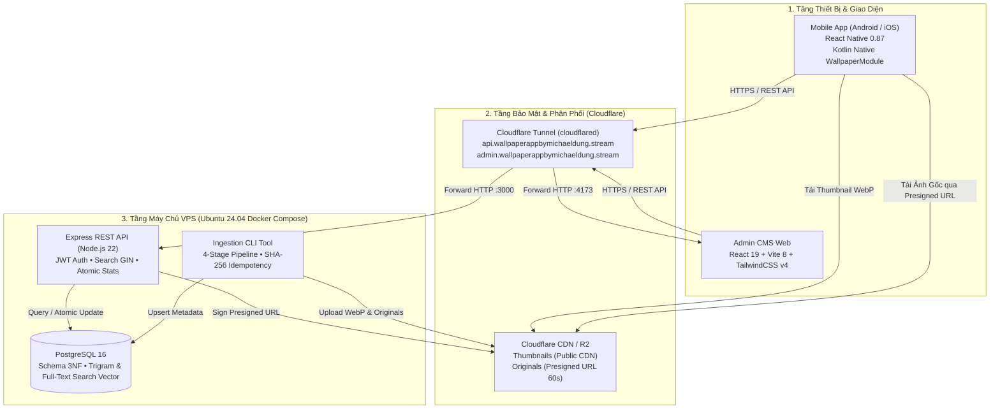

# Wallpaper Mobile App (Hệ Thống Ứng Dụng Hình Nền Di Động & Web Quản Trị)

> **Giai đoạn**: Sản phẩm Khả dụng Tối thiểu (MVP - Minimum Viable Product)  
> **Kiến trúc triển khai**: React Native 0.87 (Mobile) | React 19 / Vite 8 (Admin CMS) | Node.js 22 / Express (Backend REST API) | PostgreSQL 16 (Database 3NF) | Cloudflare R2 (Object Storage) | Cloudflare Tunnel (Zero Trust HTTPS).  
> **Trạng thái Release Gates**: Đã đạt **G1, G2, G3, G4** (Chính thức Code Freeze).

---

## 1. Tổng Quan Dự Án

Wallpaper Mobile App là hệ thống hoàn chỉnh từ đầu đến cuối (End-to-End System) phục vụ phân phối và quản lý kho hình nền chất lượng cao cho thiết bị di động. Hệ thống kết hợp giữa ứng dụng di động cho người dùng cuối, cổng thông tin quản trị CMS, pipeline xử lý dữ liệu tự động, và hạ tầng đám mây an toàn.

### Các tính năng cốt lõi trong giai đoạn MVP

*   **Ứng dụng Di động (Mobile App - React Native)**:
    *   **Khám phá (Discover Feed)**: Lưới 2 cột hiển thị thumbnail WebP nén tối ưu (tải dưới 3s, tiết kiệm 98% băng thông), hỗ trợ kéo để làm mới (Pull-to-Refresh) và cuộn vô tận (Infinite Scroll).
    *   **Bộ lọc & Sắp xếp**: 4 chế độ sắp xếp (`Mới nhất`, `Xem nhiều`, `Tải nhiều`, `Xếp hạng` theo công thức `views + 3*downloads` kèm quy tắc phá đồng điểm `published_at DESC, id ASC`).
    *   **Duyệt Danh mục & Tìm kiếm Debounce**: Lọc theo danh mục chuẩn quan hệ 3NF; tìm kiếm toàn văn không phân biệt hoa thường (Case-Insensitive) với chỉ mục GIN Trigram.
    *   **Màn hình Chi tiết & Bộ sưu tập**: Xem ảnh toàn màn hình, thông số kỹ thuật (độ phân giải, tỷ lệ), thẻ từ khóa (Tags), chia sẻ Share Sheet, lưu vào Bộ sưu tập cá nhân (Favorites/Collections).
    *   **Cài đặt Hình nền Trực tiếp (Android Native Module)**: Tích hợp Kotlin module `WallpaperModule.kt` cho phép thay đổi trực tiếp hình nền Màn hình chính (Home Screen) và Màn hình khóa qua Presigned URL bảo mật 60 giây.
    *   **Lưu ảnh vào Album (Gallery Integration)**: Tải ảnh gốc độ phân giải cao và lưu vào thư mục `Pictures/WallpaperHD` trên thiết bị.

*   **Dịch vụ Backend (Node.js / Express / TypeScript)**:
    *   Chuẩn hóa giao tiếp RESTful API với cấu trúc JSON Envelope (`success`, `data`, `meta`, `error`).
    *   Tự động ghi nhận lượt xem (`/wallpapers/:id/view`) và cập nhật điểm xếp hạng nguyên tử (Atomic Update).
    *   Cấp phát Presigned URL Cloudflare R2 có thời hạn 60 giây khi tải ảnh gốc (`/wallpapers/:id/download`), bảo vệ kho ảnh gốc `originals/` hoàn toàn PRIVATE chống crawler.
    *   Bộ kiểm thử tự động Jest/Supertest đạt 100% tỷ lệ Pass (18/18 tests).

*   **Công cụ Nạp Dữ liệu Tự động (Data Ingestion Pipeline)**:
    *   Xử lý lô 1.000+ ảnh từ file ZIP với pipeline 4 giai đoạn theo nguyên lý Clean Code & SOLID.
    *   Thẩm định tỷ lệ khung hình dọc, loại bỏ ảnh ngang và ảnh vuông (EC-02).
    *   Khử trùng lặp Idempotent 2 lớp bằng mã băm SHA-256 (EC-03), không tốn chi phí nạp lại.
    *   Nén ảnh thumbnail WebP 480px trong RAM (Zero Disk I/O) và upload lên Cloudflare R2 song song.

*   **Trang Quản trị (Admin CMS Web - React / Vite / TailwindCSS)**:
    *   Xác thực người dùng an toàn bằng JWT Bearer Token, bảo vệ route truy cập.
    *   Bảng quản trị đầy đủ trạng thái: Xuất bản (`published`), Bản nháp (`draft`), Ẩn (`hidden`).
    *   Side Modal chỉnh sửa metadata (Tiêu đề, Danh mục, Tags, Trạng thái) với cơ chế phòng chống race condition.
    *   Đồng bộ dữ liệu thời gian thực (Real-time Sync) sang Mobile App mà không cần khởi động lại ứng dụng.
    *   Trang Thống kê (Analytics Dashboard): Báo cáo KPIs, biểu đồ tương tác 7 ngày / 30 ngày, top hình nền và thẻ từ khóa thịnh hành.

*   **Hạ tầng Triển khai VPS & Cloudflare Zero Trust**:
    *   Đóng gói toàn bộ dịch vụ backend và cơ sở dữ liệu qua Docker Compose.
    *   Kết nối Internet thông qua Cloudflare Tunnel (`cloudflared`), tường lửa VPS (UFW) chỉ mở cổng SSH (port 22), bảo mật tuyệt đối không mở cổng ứng dụng ra ngoài.

---

## Sơ Đồ Kiến Trúc Hệ Thống



---

## 2. Cấu Trúc Thư Mục Dự Án

Dự án tổ chức theo mô hình Monorepo tinh gọn 2 cấp, tập trung vào các tệp tin và thư mục cốt lõi:

```text
wallpaper-mobile-app/
├── admin/                         # Web Quản trị CMS (React 19, Vite, TailwindCSS)
│   ├── src/                       # Giao diện quản trị (Pages, Components, Services)
│   └── vite.config.ts             # Cấu hình Vite & reverse proxy API
│
├── app/                           # Ứng dụng Di động (React Native 0.87)
│   ├── android/                   # Dự án Android & Kotlin Native Module (WallpaperModule.kt)
│   ├── ios/                       # Dự án iOS & cấu hình quyền Photo Library
│   └── src/                       # Giao diện ứng dụng (Screens, Components, API Service)
│
├── backend/                       # REST API Server & Công cụ nạp dữ liệu (Express, TypeScript)
│   ├── migrations/                # DDL khởi tạo Schema 3NF và chỉ mục tìm kiếm GIN / Trigram
│   ├── src/index.ts               # Express Server & toàn bộ REST API endpoints
│   ├── src/scripts/ingest.ts      # Ingestion CLI Tool 4 giai đoạn xử lý 1.000 ảnh từ file ZIP
│   └── __tests__/                 # Bộ kiểm thử tự động Jest (admin.test.ts, wallpapers.test.ts)
│
├── docs/                          # Tài liệu hệ thống (API Contract, PRD, Architecture, Testing)
├── infra/                         # Cấu hình hạ tầng
│   └── compose.yml                # Docker Compose khởi chạy PostgreSQL 16 & Backend
├── reports/                       # Báo cáo nạp dữ liệu (ingestion-report.json) và log kiểm thử E2E
├── .env.example                   # Mẫu cấu hình biến môi trường an toàn
└── spec_2.md                      # Đặc tả đề bài kỹ sư phần mềm v1.3
```

---

## 3. Hướng Dẫn Cài Đặt & Khởi Chạy

Hệ thống hỗ trợ 2 phương thức cài đặt: Chạy cục bộ để phát triển (Local) hoặc Triển khai lên máy chủ (VPS).

### Cách 1: Khởi chạy trên Môi trường Cục bộ (Local Development)

#### Điều kiện tiên quyết:
*   Node.js: Phiên bản 20.x hoặc 22.x LTS.
*   Docker Desktop: Để khởi chạy PostgreSQL 16.
*   Android Studio & SDK Platform 34/35: Kèm Java JDK 17 (cấu hình `JAVA_HOME`).
*   Thiết bị Android thật (đã bật USB Debugging) hoặc Android Emulator.

#### Bước 1: Chuẩn bị mã nguồn & biến môi trường
```bash
git clone https://github.com/Michael-Dung-IsMe/wallpaper-mobile-app.git
cd wallpaper-mobile-app

cp .env.example backend/.env
# Mở file backend/.env và điền thông tin R2 cùng JWT_SECRET
```

#### Bước 2: Khởi động Database & Chạy Migration
```bash
# 1. Khởi động PostgreSQL local
cd infra
docker compose up -d db

# 2. Chạy migration tạo bảng và chỉ mục
cd ../backend
npm install
npm run migrate

# 3. Nạp dữ liệu mẫu ban đầu (Seed data)
npm run seed
```

*(Tùy chọn)* Nạp tập dữ liệu ảnh mẫu từ file ZIP:
```bash
npm run ingest -- --zip ../wallpaper-demo-1000.zip --limit 20
```

#### Bước 3: Khởi chạy Backend API & Kiểm thử Jest
```bash
cd backend
npm run dev

# Chạy bộ kiểm thử tự động (18/18 tests passed)
npm test
```
> Backend API khởi chạy tại: `http://localhost:3000` (Kiểm tra: `curl http://localhost:3000/health`).

#### Bước 4: Khởi chạy Admin CMS Web
Mở một cửa sổ Terminal mới:
```bash
cd admin
npm install
npm run dev
```
> Admin Web hoạt động tại: `http://localhost:5173`. Tài khoản mặc định: `admin` / mật khẩu đã hash trong `.env`.

#### Bước 5: Khởi chạy Ứng dụng Di động Android
Mở một cửa sổ Terminal mới:
```bash
# Chuyển tiếp cổng mạng từ thiết bị Android về máy host (BẮT BUỘC)
adb reverse tcp:3000 tcp:3000

# Khởi động Metro Bundler
cd app
npm install
npm run start
```
Mở một Terminal khác để build và cài đặt app vào thiết bị Android:
```bash
cd app
npm run android -- --no-packager
```

---

### Cách 2: Triển Khai Trên Máy Chủ VPS (Production with Cloudflare Tunnel)

Phương pháp này triển khai Backend và Database lên VPS Ubuntu 24.04, đưa ra Internet qua Cloudflare Tunnel mà không cần mở cổng ứng dụng trên tường lửa VPS.

#### Điều kiện tiên quyết trên VPS:
*   Máy chủ VPS Ubuntu 24.04 (IP: `207.180.209.221` hoặc tương đương).
*   Đã cài đặt Docker, Docker Compose, curl, git, ufw.
*   Tên miền (ví dụ: `wallpaperappbymichaeldung.stream`) đã được trỏ Nameservers về Cloudflare.

#### Bước 1: Thiết lập Tường lửa UFW (Chỉ mở cổng SSH)
```bash
sudo ufw default deny incoming
sudo ufw default allow outgoing
sudo ufw allow 22/tcp
sudo ufw enable
sudo ufw status
```

#### Bước 2: Chuẩn bị Dự án & Biến Môi Trường trên VPS
```bash
cd /opt
git clone https://github.com/Michael-Dung-IsMe/wallpaper-mobile-app.git wallpaper-project
cd wallpaper-project/infra

nano .env
```
Nội dung file `.env`:
```env
POSTGRES_USER=wallpaper
POSTGRES_PASSWORD=your_strong_password
POSTGRES_DB=wallpaper_db

R2_ACCOUNT_ID=your_cloudflare_account_id
R2_ACCESS_KEY_ID=your_r2_access_key
R2_SECRET_ACCESS_KEY=your_r2_secret_key
R2_BUCKET_NAME=wallpaper-assets
R2_ENDPOINT=https://<ACCOUNT_ID>.r2.cloudflarestorage.com
R2_PUBLIC_URL=https://cdn.wallpaperappbymichaeldung.stream

JWT_SECRET=super_secret_jwt_key_min_32_characters_for_security
ADMIN_PASSWORD_HASH=$2a$10$abcdefghijklmnopqrstuvwxyz0123456789
```

#### Bước 3: Khởi chạy Docker Compose & Nạp Dữ Liệu 1.000 Ảnh
```bash
# Khởi động cụm container
docker compose up -d --build

# Chạy migration tạo bảng
docker compose exec backend npm run migrate

# Nạp toàn bộ 1.000 ảnh từ volume dữ liệu
docker compose exec backend npm run ingest -- --zip /opt/wallpaper-training/wallpaper-demo-1000.zip
```

#### Bước 4: Cấu hình Cloudflare Tunnel (`cloudflared`) trên VPS
```bash
# Cài đặt cloudflared trên Ubuntu
curl -L --output cloudflared.deb https://github.com/cloudflare/cloudflared/releases/latest/download/cloudflared-linux-amd64.deb
sudo dpkg -i cloudflared.deb

# Đăng nhập và tạo Tunnel
cloudflared tunnel login
cloudflared tunnel create wallpaper-tunnel
```
Cấu hình file `/root/.cloudflared/config.yml`:
```yaml
tunnel: <TUNNEL_UUID>
credentials-file: /root/.cloudflared/<TUNNEL_UUID>.json

ingress:
  - hostname: api.wallpaperappbymichaeldung.stream
    service: http://localhost:3000
  - hostname: admin.wallpaperappbymichaeldung.stream
    service: http://localhost:4173
  - service: http_status:404
```
Kích hoạt systemd service:
```bash
cloudflared tunnel route dns wallpaper-tunnel api.wallpaperappbymichaeldung.stream
cloudflared tunnel route dns wallpaper-tunnel admin.wallpaperappbymichaeldung.stream

sudo cloudflared service install
sudo systemctl enable --now cloudflared
```

#### Bước 5: Kiểm chứng Kết nối
Từ máy bất kỳ, kiểm tra endpoint sức khỏe qua HTTPS:
```bash
curl -I https://api.wallpaperappbymichaeldung.stream/health
```
Kết quả trả về `HTTP/2 200 OK` xác nhận hệ thống đã hoạt động ổn định trên VPS.

---

## 4. Dự Định Phát Triển Tiếp Theo (Post-MVP Roadmap)

Sau khi hoàn thành cột mốc MVP và đóng băng mã nguồn, lộ trình nâng cấp tiếp theo gồm 4 định hướng trọng tâm:

### 4.1. Xây dựng Landing Page trên Domain Chính (`wallpaperappbymichaeldung.stream`)
*   **Mục tiêu**: Xây dựng trang giới thiệu chính thức tại tên miền gốc để quảng bá ứng dụng, cung cấp link tải trực tiếp file Release APK cho người dùng Android và tài liệu hướng dẫn trải nghiệm.
*   **Giải pháp kỹ thuật** (Theo tài liệu `docs/architecture/landing_page_architecture.md`):
    *   Sử dụng mã nguồn tĩnh (HTML5/CSS3 hoặc Vite/Astro) với phong cách Dark Mode và Glassmorphism đồng nhất với ứng dụng di động.
    *   Hero Section giới thiệu kho hình nền kèm mockup điện thoại trực quan.
    *   Nút CTA: "Tải file APK (Android)" trỏ trực tiếp tới bản build phát hành `wallpaper-demo.apk`.
    *   Tích hợp đầy đủ các trang pháp lý bắt buộc: Chính sách bảo mật (Privacy Policy) và Điều khoản dịch vụ (Terms of Service).

### 4.2. Đào Sâu Các Bài Toán Kỹ Thuật Nâng Cao Trong Mobile App
*   **Đồng bộ Thời Gian Thực (Real-time Live Sync)**:
    *   Ứng dụng Server-Sent Events (SSE) hoặc WebSocket giữa Backend và Mobile App.
    *   Khi Quản trị viên ẩn hoặc sửa ảnh trên Admin CMS, Mobile App tự động cập nhật feed tức thì mà không cần người dùng kéo vuốt để làm mới.
*   **Thuật Toán Xếp Hạng Xu Hướng Cải Tiến (Time-decay Trending Algorithm)**:
    *   Nâng cấp công thức ranking hiện tại sang mô hình phân rã thời gian:
        $$\text{Score} = (\text{views} + 3 \times \text{downloads}) \times e^{-\lambda \cdot \Delta t}$$
    *   Tạo điều kiện cho những hình nền mới xuất bản có tương tác tốt nhanh chóng lên đầu danh sách thịnh hành.
*   **Bộ Nhớ Đệm Thông Minh & Prefetching (Smart Offline Caching)**:
    *   Xây dựng cơ chế LRU Disk Cache cho hình ảnh trên thiết bị.
    *   Chủ động prefetch 3-5 ảnh tiếp theo khi người dùng đang xem chi tiết một hình nền, giúp thao tác vuốt xem ảnh đạt độ trễ bằng 0.

### 4.3. Nghiên Cứu & Tăng Cường Cơ Chế Bảo Mật Ứng Dụng (Mobile App Security)
*   **Ghim Chứng Chỉ SSL (SSL / TLS Pinning)**:
    *   Cấu hình SSL Pinning trong React Native và Native Network Layer để ngăn chặn các cuộc tấn công nghe lén Man-in-the-Middle (MitM) qua proxy hoặc tool phân tích gói tin (như Charles Proxy, Burp Suite).
*   **Chống Khai Thác Băng Thông & Tải Lậu Hàng Loạt (Anti-Scraping & Rate Limiting)**:
    *   Bổ sung Rate Limiting theo Device Fingerprint và IP trên endpoint cấp Presigned URL `/wallpapers/:id/download`.
    *   Tạo Dynamic Token ký số dùng một lần (One-Time Nonce) trên mỗi phiên mở màn hình chi tiết để ngăn bot tự động crawl toàn bộ kho ảnh gốc từ R2.
*   **Làm Rối Mã Nguồn & Phát Hiện Thiết Bị Bẻ Khóa (Obfuscation & Root/Jailbreak Detection)**:
    *   Áp dụng ProGuard / R8 để làm rối mã nguồn Kotlin và bảo vệ chuỗi nhạy cảm trước nguy cơ Reverse Engineering.
    *   Thêm cơ chế kiểm tra môi trường chạy để cảnh báo hoặc hạn chế các tính năng nhạy cảm trên máy Android đã Root.

### 4.4. Chuẩn Bị Báo Cáo Nghiệm Thu Toàn Diện & Live Demo (Gate G5)
*   Hoàn thiện báo cáo kiểm thử tổng thể Deliverable D-10 (`reports/test-report.md`) tổng hợp đầy đủ 13 tiêu chí đo lường được (SC-001 đến SC-013).
*   Đóng gói file cài đặt Release APK chuẩn hóa (`wallpaper-demo.apk`) và hoàn tất 11 hạng mục bàn giao (D-01 đến D-11).
*   Biên soạn bộ Slide thuyết trình 10 mục chuẩn mực theo đặc tả `spec_2.md` và tổng duyệt kịch bản Live Demo 8 bước thông suốt trước hội đồng đánh giá.
